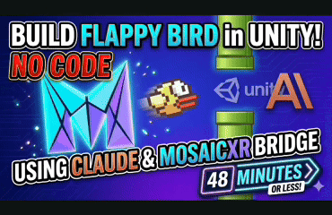

# Mosaic Bridge

[](LICENSE)
[](https://unity.com)
[](https://modelcontextprotocol.io/)
[](https://github.com/MosaicXR-AI/mosaic-bridge/releases)
[](https://www.npmjs.com/package/@mosaicxr-ai/create-bridge)
[](https://www.npmjs.com/package/@mosaicxr-ai/mcp-server)
[](https://github.com/MosaicXR-AI/mosaic-bridge/stargazers)

**AI agents that drive the Unity Editor.**

Mosaic Bridge connects MCP-compliant AI clients — Claude Code, Claude Desktop,
Cursor, Gemini CLI, and any other Model Context Protocol client — to a running
Unity Editor. It exposes ~290 tools covering GameObject and scene operations,
procedural generation, physics simulation, pathfinding, rendering, animation,
and more.

Free and open source under Apache 2.0. No telemetry. Your project never leaves
your machine.

## See it work

[](https://www.youtube.com/watch?v=EIXiSQ0z1ZY)

> *"Build me a Flappy Bird clone in Unity"*
>
> 48 minutes later: a working game. No code written by hand, no manual editor clicks —
> Claude drove every Unity action through Mosaic Bridge tools.
>
> **▶ [Watch the full build on YouTube](https://www.youtube.com/watch?v=EIXiSQ0z1ZY)**

```text
  You:     "Create a 3D tic-tac-toe board with warm wood styling and
            glowing cyan X pieces"
  Claude:  calls mosaic_gameobject_create, mosaic_material_create (uses
            KB for oak albedo), mosaic_physics_add-rigidbody, …
  Unity:   board appears in your scene, ready to play
```

---

## What makes it different

- **Research-paper implementations.** ~90 of the tools are original
  implementations of published CS, graphics, and AI papers — Bridson's Poisson
  Disk (2007), Müller's SPH fluid (2003), Stam's Stable Fluids (1999), Orkin's
  GOAP (F.E.A.R. 2003), Lorensen-Cline Marching Cubes (1987), Reynolds' Boids
  (1987), Harabor-Grastien Jump Point Search (2011), Garland-Heckbert quadric
  decimation (1997). Not wrappers over Unity APIs — actual algorithms, callable
  by AI.

- **Curated knowledge base.** Tools that return physical quantities (density,
  friction, IOR, color temperature) draw from a bundled reference library — NIST
  physics constants, Unity's PhysicallyBased material data. Responses include
  citations. No hallucinated numbers.

- **Multi-Unity-version.** Works across Unity 6 (see [Requirements](#requirements)
  for the tested matrix). Each Editor runs in its own per-project runtime
  directory, so multiple Editors on different projects can run concurrently
  without fighting for ports or files.

- **Privacy-first.** Loopback-only HTTP listener bound to 127.0.0.1,
  HMAC-SHA256 authenticated, telemetry off by default. Ephemeral ports,
  per-project discovery files (mode 0600 on Unix).

- **Vendor-neutral.** Apache 2.0 with explicit patent grant. Not a funnel for a
  paid product. Your tools, your keys, your data.

---

## Requirements

- **Unity 6000.3 or newer** (see the matrix below)
- Node.js 18+ (for the MCP server)
- macOS, Windows, or Linux

### Unity version support

**The installer checks this for you.** `npx @mosaicxr-ai/create-bridge` reads the
project's `ProjectVersion.txt` and refuses to install into an editor the bridge
cannot work on, rather than letting you discover it as compile errors after Unity
reimports. Warnings don't block; errors do, and can be overridden with
`--ignore-unity-version` if you know what you're doing.

| Unity | Installer | Status |
|-------|-----------|--------|
| 6000.3 | ✅ installs | Verified — full Editor test suite |
| 6000.4 | ⚠️ warns | Compiles and runs, but emits deprecation warnings |
| 6000.5 | ✅ installs | Verified — full Editor test suite (recommended) |
| 6000.6.0a2 | ⚠️ warns | Verified, but a prerelease |
| 6000.6.0b1+ | ❌ blocks | Not supported yet — see below |
| 6000.0 – 6000.2 | ❌ blocks | No `UnityEngine.EntityId` |
| 2022 LTS and older | ❌ blocks | Not supported |

Node 18+ is checked the same way, before the installer touches your project.

All checks run identically on **macOS, Windows, and Linux** — the installer resolves
paths per-platform and reads `ProjectVersion.txt` with either LF or CRLF line endings,
so a project authored on Windows and one on macOS are treated the same.

Unity 6.5 replaced the 32-bit instance ID with the 64-bit `EntityId`. The bridge
adapts to this automatically and keeps `InstanceId` a 32-bit `int` on the MCP wire,
so tool schemas are unchanged. Unity 6000.6.0b5 changed the `EntityId` bit layout
again such that a 32-bit id can no longer identify an object, and Unity exposes no
supported conversion — supporting b5+ requires widening the id across the wire.
Tracked as a known limitation in the [CHANGELOG](packages/com.mosaic.bridge/CHANGELOG.md).

---

## Quick install

One command. It walks you through the rest:

```bash
npx @mosaicxr-ai/create-bridge
```

The installer:

1. Asks for your Unity project path (create one in Unity Hub first if you
   haven't — any empty Unity 6000.3+ project works)
2. Asks which MCP client(s) to configure — Claude Code, Claude Desktop,
   Cursor, Gemini CLI, or OpenAI Codex (any combination)
3. Adds `com.mosaic.bridge` to the project's `Packages/manifest.json`
4. Writes the MCP server entry into each selected client's config

Then open the Unity project, wait for compile, restart your MCP client, and
start prompting.

### Updating to a newer version

Unity resolves a git dependency **once** and pins the resolved commit in
`Packages/packages-lock.json`. It never re-checks, so simply re-running the
installer reports `already present — skipped` and your project stays on the commit
it first landed on. To actually upgrade:

```
npx @mosaicxr-ai/create-bridge --project-path <your-project> --update --yes
```

That rewrites the manifest entry and clears the pin, so Unity fetches the latest
`main` the next time you open the project. To pin an exact commit, tag, or branch —
useful when you need to know precisely what you're running:

```
npx @mosaicxr-ai/create-bridge --project-path <your-project> --ref main --yes
```

`--ref` implies `--update`. Reopen the Unity project afterwards and let it recompile.
To confirm which commit you ended up on, check the folder name under
`Library/PackageCache/com.mosaic.bridge@<commit>`, or the version shown in
Window → Package Manager.

### Non-interactive (CI / scripted)

Commands are written on a single line so they work unchanged in **cmd**,
**PowerShell**, and **bash** — no shell-specific line continuations:

```
npx @mosaicxr-ai/create-bridge --project-path /path/to/UnityProject --clients claude-code,cursor --yes
```

See `npx @mosaicxr-ai/create-bridge --help` for all flags.

### Scene-building intelligence + cross-LLM agents

The installer writes instruction files and specialist agents into your Unity project for every
supported AI client:

| File | Client |
|------|--------|
| `CLAUDE.md` | Claude Code + Claude Desktop |
| `GEMINI.md` | Gemini CLI |
| `AGENTS.md` | OpenAI Codex |
| `.cursor/rules/mosaic-bridge.mdc` | Cursor |

All instruction files enforce:

- **Interview before building** — when you give a vague prompt like "make me a desert scene",
  the AI asks 4 targeted questions (scene type, geographic reference, scale, player perspective)
  before touching any tools.
- **Spatial coherence** — every placed object Y is resolved from `terrain/sample-height`
  before placement. No more objects buried underground or floating in air.
- **Correct build order** — terrain → textures → lighting → structures → vegetation →
  post-processing → camera.

Three specialist skill agents are installed following the [bmad-method](https://github.com/bmadcode/bmad-method)
convention — written to both `.claude/skills/` (Claude Code slash commands) and
`.agents/skills/` (universal, works with Cursor, Gemini, Codex, Windsurf, OpenCode):

| Agent | Claude Code | Cursor | Codex | Best for |
|-------|-------------|--------|-------|----------|
| Zara — Project Guide | `/mosaic-guide` | `@mosaic-guide` | `$mosaic-guide` | Session start, preflight, pipeline issues |
| Ray — Shader Expert | `/mosaic-shader` | `@mosaic-shader` | `$mosaic-shader` | ShaderGraph creation, node wiring, debugging |
| Max — Scene Builder | `/mosaic-scene` | `@mosaic-scene` | `$mosaic-scene` | Full scene construction, particles, physics |

The installer also copies four **workflows** into `.claude/workflows/`
(`preflight`, `scene-plan`, `shader-guide`, `session-handoff`).

### Workflow prompts (any MCP client)

Beyond the instruction files, the MCP server exposes the same protocol rules as
**MCP prompts**, so every client — not just ones with a `CLAUDE.md` — can pull
them on demand: `preflight`, `scene-interview`, `session-handoff`, and
`shader-guide`. In Claude Code they show up in the prompt picker; other clients
list them via `prompts/list`.

To skip writing instruction files:

```bash
npx @mosaicxr-ai/create-bridge --skip-claude
```

To refresh after an update:

```bash
npx @mosaicxr-ai/create-bridge --force
```

### Manual install (if you prefer)

Add to `<UnityProject>/Packages/manifest.json`:

```json
{
  "dependencies": {
    "com.mosaic.bridge": "https://github.com/MosaicXR-AI/mosaic-bridge.git?path=/packages/com.mosaic.bridge"
  }
}
```

Then point your MCP client at:

```json
{
  "mcpServers": {
    "mosaic-bridge": {
      "command": "npx",
      "args": ["-y", "@mosaicxr-ai/mcp-server", "--project-path", "/path/to/UnityProject"]
    }
  }
}
```

---

## What's inside

~290 tools across 64 categories. A sample:

| Category | Tools | Notable |
|---|---|---|
| Procedural Generation | 17 | Poisson Disk, Marching Cubes, Hydraulic Erosion, Wave Function Collapse, L-Systems, Voronoi, Blue Noise, Perlin / Simplex noise, 3D noise textures |
| Simulation | 8 | SPH fluid, Boids, Stable Fluids / smoke, agent-based (ant colony, slime mold), cloth, orbital mechanics |
| AI Behaviors | 11 | GOAP, Utility AI, Context Steering, Flow Fields, Jump Point Search, Behavior Trees, Steering |
| Advanced Mesh | 10 | Quadric decimation, QuickHull, BSP/CSG boolean, Dual Contouring, icosphere subdivision |
| Advanced Rendering | 12 | Volumetric clouds, atmospheric scattering, ray marching, SDF text, portals |
| Physics | 10 | Rigidbody, collider, raycast, overlap, gravity, physics material, joints |
| Spatial Data Structures | 6 | Spatial hash, k-d tree, octree |
| Scene Intelligence | 4 | `scene/create-object` (asset search → store → procedural build), `asset/find-3d`, `scene/plan-composition`, `terrain/get-regions` |
| GameObjects & Scenes | 15 | Create, delete, duplicate, reparent, hierarchy, stats, snap-to-ground |
| Prefabs & Assets | 13 | Create, instantiate, overrides, variants, import, list, find-3d |
| Components & Scripts | 9 | Add, remove, set property / reference, create/read/update scripts |
| Animation | 7 | Controllers, states, blend trees, clips, IK setup, transitions |
| Lighting & Graphics | 13 | Lights, baking, shaders, post-processing, shadergraph |
| Cameras & ScreenShots | 6 | Camera info, scene/game/camera screenshots |
| UI | 5 | Canvas, elements, layouts, rect transforms |
| Navigation | 10 | NavMesh, agents, obstacles, pathfinding, FOV visualization, FABRIK IK |
| Terrain | 10 | Height, paint, trees, detail, settings, grid, erosion, sample-height, get-regions |
| Particles | 7 | Create, set-shape, set-emission, set-renderer, set-main, playback, info |
| Package Integrations | ~28 | Cinemachine, ProBuilder, Addressables, TextMeshPro, URP, HDRP, Splines, VisualScripting |

Plus: editor control (play mode, run-block, execute code, menu items), profiler,
timeline, input system, constraints, LOD, assembly definitions, reflection,
undo/redo, selection, tags & layers, settings, build, console, measurement, data
visualization.

Full tool list: `Packages/com.mosaic.bridge/Editor/Tools/` after install, or
browse [here](packages/com.mosaic.bridge/Editor/Tools/).

---

## Knowledge base

Tools that return physical values consult a bundled, versioned reference library:

- **`physics/constants.json`** — NIST CODATA fundamental constants
- **`rendering/pbr-materials.json`** — PhysicallyBased API material values (CC0)
- **`rendering/render-pipeline-compat.json`** — shader ↔ pipeline compatibility matrix (URP / HDRP / BuiltIn)
- **`rendering/shadergraph-nodes.json`** — 38 node aliases with input/output slot descriptions
- **`rendering/unity-api-quirks.json`** — documented API pitfalls with tested workarounds
- Planned: animation timing, audio attenuation, spatial metrics, color temperature, lighting presets

When a tool consults the KB, it attaches a citation to its response envelope so
the AI knows which source a value came from. If a requested value isn't in the
KB, the tool surfaces an explicit "no data available" warning rather than
fabricating a number.

---

## Supported MCP clients

Mosaic Bridge is protocol-native — it speaks [Model Context Protocol
2024-11-05](https://modelcontextprotocol.io/). The installer configures all
of these in one pass:

| Client | Config file | Format | Auto-configured? |
|---|---|---|---|
| **Claude Code** | `<project>/.mcp.json` | JSON | ✅ via installer (+ auto-written by bridge on first start) |
| **Claude Desktop** | `~/Library/Application Support/Claude/claude_desktop_config.json` | JSON | ✅ via installer |
| **Cursor** | `~/.cursor/mcp.json` | JSON | ✅ via installer |
| **Gemini CLI** | `~/.gemini/settings.json` | JSON | ✅ via installer |
| **OpenAI Codex CLI** | `~/.codex/config.toml` | TOML | ✅ via installer |
| **Windsurf, OpenCode, GitHub Copilot, others** | see each client's docs | varies | Manual MCP config; `AGENTS.md` + `.agents/skills/` written by installer for agent support |

Any MCP 2024-11-05 compliant client works with manual config. The auto-config
list above is just the clients the installer knows paths/formats for today.

---

## Multi-project: run several Unity Editors at once

Each Editor gets its own runtime directory under
`~/Library/Application Support/Mosaic/Bridge/{projectHash}/` (macOS;
analogous paths on Windows and Linux). State files never collide.

To have one MCP client talking to multiple Unity projects, register one MCP
server per project:

```json
{
  "mcpServers": {
    "mosaic-bridge-game": {
      "command": "node",
      "args": ["/path/to/mcp-server/dist/index.js", "--project-path", "/path/to/MyGame"]
    },
    "mosaic-bridge-factory": {
      "command": "node",
      "args": ["/path/to/mcp-server/dist/index.js", "--project-path", "/path/to/Factory"]
    }
  }
}
```

Each server connects to exactly the specified Editor. When you say *"in my game
project, create a cube"*, the client routes to the correct server by namespace.

Launched without `--project-path`, the server inspects the shared instance
registry:
- Zero live Editors: clear error with setup guidance
- One live Editor: auto-selects it
- Two+ live Editors: structured error listing projects and the flags to
  disambiguate

### MCP server flags

```
mosaic-mcp [options]
mosaic-mcp doctor [options]  Diagnose the bridge connection and exit

  --project-path <path>     Unity project root (recommended)
  --project-hash <hash>     16-hex-char project hash
  --runtime-dir <dir>       Explicit per-project runtime directory
  --discovery-file <file>   Direct path to bridge-discovery.json
  -h, --help                Show help
  -v, --version             Show version
```

---

## Troubleshooting

**Tools don't appear, or the client says the connection closed?** Run the
built-in doctor — it checks every link in the chain and tells you exactly which
one is broken:

```bash
npx @mosaicxr-ai/mcp-server doctor --project-path /path/to/UnityProject
```

A healthy bridge reports all green:

```
  ✓ Discovery file: Found and signed (…/bridge-discovery.json), Unity 6000.3.10f1, port 8282.
  ✓ Live editor: 1 running Unity Editor (pid 56258, port 8282).
  ✓ Port reachable: 127.0.0.1:8282 accepted a connection.
  ✓ Health + HMAC: Bridge healthy — 265 tools, state Running.
  ✓ Clock skew: System clock within tolerance of the bridge host.

  Result: OK — the bridge is reachable.
```

Common failures and fixes:

| Symptom | Cause | Fix |
|---|---|---|
| `✗ Discovery file: No live Unity Editor detected` | Unity isn't open, or the project's bridge hasn't started | Open the project in the Editor, wait for compile, and check the Console for `Mosaic Bridge bootstrap complete` |
| `✗ Discovery file: Not found at …/<hash>/` | Wrong `--project-path` (relative paths resolve against your shell's current dir) | Pass an **absolute** project path, or omit `--project-path` to auto-detect the single running Editor |
| `✗ Health + HMAC: … 401` | The bridge rotated its secret on a domain reload | Restart your MCP client so it re-reads the discovery file |
| `⚠ Live editor: N running editors` | Multiple Editors are open | Pass `--project-path` so the server targets the right one |
| `⚠ Clock skew` | System clock differs from the bridge host | Sync the clock — large skew trips the HMAC timestamp window |

With no `--project-path` and exactly one Editor open, `doctor` (and the server
itself) auto-detects it — the simplest way to avoid path mistakes.

---

## Architecture

```
                 Unity Editor (main thread)
                         │
                         │  [MosaicTool] attribute discovery via TypeCache
                         │
                ┌────────▼────────┐
                │  Mosaic Bridge  │   Unity C# package
                │   Core + Tools  │   In-process, main-thread dispatched
                └────────┬────────┘
                         │
                         │  HTTP on loopback (127.0.0.1, ephemeral port)
                         │  HMAC-SHA256 challenge-response authentication
                         │  Discovery file at {project-hash} runtime dir
                         │
                ┌────────▼────────┐
                │  MCP Server     │   Node.js / TypeScript
                │  stdio ↔ MCP    │
                └────────┬────────┘
                         │
                         │  Model Context Protocol over stdio
                         │
      ┌──────────────────┼──────────────────┬──────────────┐
      │                  │                  │              │
  Claude Code      Claude Desktop        Cursor        Gemini CLI
```

**Key properties:**
- In-process bridge — Unity APIs are main-thread-only, cross-process calls
  throw `UnityException`
- Main-thread dispatch via `EditorApplication.update` — guaranteed safe
- Survives Unity domain reloads via `SessionState` persistence
- `TypeCache` discovery — add a static method with `[MosaicTool(...)]`,
  it's automatically callable
- Per-project isolation — multiple Editors never share mutable state files
- Telemetry off by default

---

## Development

```bash
git clone https://github.com/MosaicXR-AI/mosaic-bridge.git
cd mosaic-bridge

# MCP server
cd packages/mcp-server
npm install
npm run build
npm test

# Installer CLI
cd ../create-bridge
npm install
npm test

# Unity package — install via file: reference in a test project's manifest.json
# See TESTING.md for the full test workflow (all three suites).
```

Monorepo layout:

```
packages/
├── com.mosaic.bridge/       Unity UPM package (Editor + Runtime + Tests)
│   ├── Editor/              ~290 tools + core infrastructure
│   ├── Runtime/             Runtime-compatible tool subset
│   ├── Tests/               NUnit + Unity Test Runner
│   └── Samples~/            Custom-tool authoring sample
└── mcp-server/              Node.js MCP server (TypeScript + Vitest)
```

Running Unity tests requires opting in via `testables` in the consuming
project's `manifest.json`:

```json
{
  "testables": ["com.mosaic.bridge"]
}
```

---

## Roadmap

### v1.0 beta (current)
- Core bridge, MCP server, ~290 tools across 64 categories
- Per-project runtime isolation
- Auto `.mcp.json` for Claude Code + auto-config for Claude Desktop, Cursor,
  Gemini CLI, and OpenAI Codex CLI via `npx @mosaicxr-ai/create-bridge`
- Windows `cmd /c` wrapper for stdio MCP launch (beta.2)
- Scene intelligence: `scene/create-object` decision tree (project search →
  Asset Store → procedural build), spatial coherence tools, build plans
- `editor/run-block` multi-statement C# execution with polling
- Knowledge base with Unity-version-aware guidance + rendering compat KB (beta.3)
- `project/preflight` — render pipeline + color property detection (beta.3)
- `material/create-batch` — bulk material creation (beta.3)
- Cross-LLM specialist agents via bmad-method SKILL.md format (beta.3):
  Zara, Ray, Max installed to `.claude/skills/` + `.agents/skills/`
- Unity project asset resources in MCP (`@Unity Prefabs`, `@Unity Materials`, etc.) (beta.3)
- Workflow rules exposed as MCP prompts — `preflight`, `scene-interview`,
  `session-handoff`, `shader-guide` — so every client receives them (beta.7)
- `mosaic-mcp doctor` — one-command connection diagnostics (discovery file,
  live editor, port, HMAC handshake, clock skew) (beta.7)
- Unity 6.5 `EntityId` migration — object identity routed through a single
  version-guarded shim, so the package builds warning-free on Unity 6000.3,
  6000.5 and 6000.6.0a2 while keeping `InstanceId` a 32-bit `int` on the MCP
  wire (beta.6)
- Apache 2.0 license with patent grant

### v1.0 stable
- Unity Asset Store listing
- OpenUPM registry publication
- First docs site
- Runtime `kb/query` + `kb/fetch` server contract live
- `kb/watch` background drift detector for Unity-docs updates

### v1.1+
- Widen `InstanceId` to a 64-bit id on the MCP wire, unblocking Unity 6000.6.0b5+
  (see [Requirements](#requirements)) — a breaking schema change, so it needs a
  major or a compatibility window
- Migrate remaining deprecated Unity API usage to modern equivalents
- Expand knowledge base (animation, audio, level design, lighting presets)
- Runtime (compiled build) tool support for more categories
- Performance profiler integration

See [open issues](https://github.com/MosaicXR-AI/mosaic-bridge/issues) for the
live backlog, and [Discussions](https://github.com/MosaicXR-AI/mosaic-bridge/discussions)
for design conversations.

---

## Contributing

Contributions welcome — pull requests, issues, test coverage, docs. Every
commit must be signed off per the [Developer Certificate of Origin](https://developercertificate.org/):

```bash
git commit -s -m "your message"
```

See [CONTRIBUTING.md](CONTRIBUTING.md) for the full workflow, and
[CODE_OF_CONDUCT.md](CODE_OF_CONDUCT.md) for community standards.

**Security vulnerabilities:** please disclose privately — see
[SECURITY.md](SECURITY.md).

---

## License

[Apache License 2.0](LICENSE). Includes an explicit patent grant.

Individual research-backed tools cite the papers they implement. Algorithm
citations are embedded in the source code and returned in tool response
envelopes where relevant.

---

## Credits

Built and maintained by [Mousa Soutari](https://github.com/MousaSoutari) /
[MosaicXR](https://mosaicxr.ai).

Research-paper implementations respectfully credit their authors. Knowledge
base values are sourced from public authoritative data (NIST, Unity
PhysicallyBased, etc.) under their respective licenses.

If you build something interesting with Mosaic Bridge, open a
[Discussion](https://github.com/MosaicXR-AI/mosaic-bridge/discussions) — we'd
love to see it.
